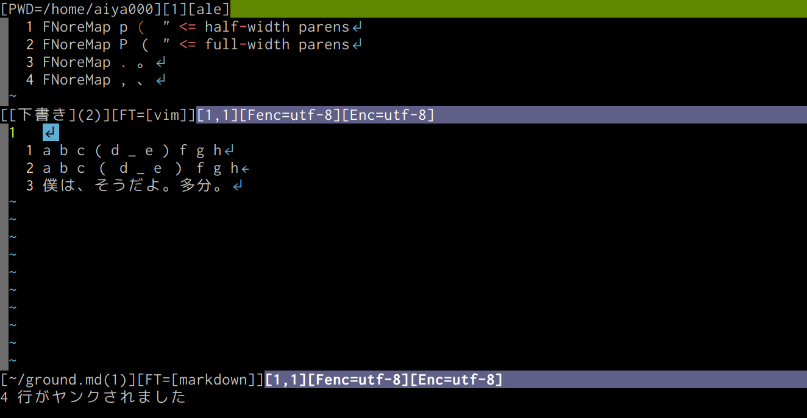

# :diamond_shape_with_a_dot_inside: vim-fmap :diamond_shape_with_a_dot_inside:
This vim plugin takes a way for mappping `f` of Vim :laughing:



For example, with this preference

```vim
autocmd! VimEnter * FNoreMap pb (
autocmd! VimEnter * FNoreMap pe )

nmap <leader>f <Plug>(fmap-forward-f)
```

When the cursor is here (`_` is the cursor)

```
d _ e ) f g h
```

:sunny: You can move the cursor to `)` with `<leader>fpb` keymap :sunny:

# :thinking: How to use this :thinking:
Please add the following line into your .vimrc

With dein.vim

```vim
call dein#add('aiya000/vim-fmap')
```

With dein.vim and .toml

```vim
[[plugins]]
repo = 'aiya000/vim-fmap'
```

or

```vim
[[plugins]]
repo = 'aiya000/vim-fmap'
on_map = [
    '<Plug>(fmap-forward-f)',
    '<Plug>(fmap-backward-f)',
    '<Plug>(fmap-forward-t)',
    '<Plug>(fmap-backward-t)',
]
on_cmd = 'FNoreMap'
```

# Plans

- the `target` for characters
    - `['(', '（']` of `let g:fmap_default_mappings = [{ 'target': ['(', '（'], 'strokes': ['pb'] }]`
    - ^ shots the first of `(` and `（`
- augroup FmapShotPre, FmapShotPost
